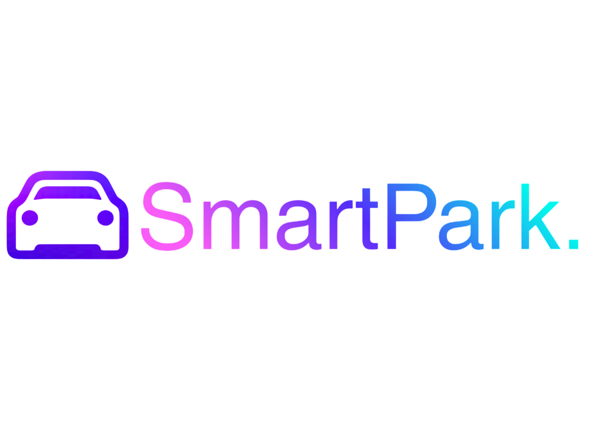

<div align="center">
  
  <h1>SmartPark v6</h1>

</div>

## Overview

**SmartPark v6** is the next generation of our IoT-enabled parking management solution. **Version 6 introduces a major technological paradigm shift**: We've transitioned from traditional ultrasonic sensors to **AI-Powered Computer Vision** for intelligent occupancy detection. 

Utilizing **Edge AI** running directly on Raspberry Pi hardware with integrated camera modules, the system now provides real-time, high-fidelity vehicle detection. An intuitive **ROI (Region of Interest) Paint Tool** empowers administrators to dynamically define parking regions without hardware modifications—enabling rapid deployment and reconfiguration across multiple facilities.

---

## What's New in v6: Technology Evolution

### From Sensors to Computer Vision
- **Previous Approach**: Individual HC-SR04 ultrasonic sensors per slot (wiring complexity, maintenance burden).
- **v6 Paradigm**: Single camera feed with AI-powered multi-region monitoring (scalable, flexible, maintainable).

### Edge AI Integration
- **Real-Time Processing**: All inference runs on-device (Raspberry Pi 4/5)—zero cloud latency, zero external dependencies.
- **Dual-Camera Architecture**: Monitor multiple parking areas independently and simultaneously.
- **YOLOv8 Nano**: State-of-the-art, lightweight object detector optimized for edge deployment. Achieves real-time multi-class vehicle detection (cars, motorcycles, buses, trucks) with <50ms inference latency on entry-level hardware.

### Intelligent Configuration Without Redeployment
- **ROI Paint Tool**: Administrators "paint" parking regions directly on live feeds in the web UI.
- **Zero-Friction Updates**: Reconfigure entire regions without physical hardware changes or model retraining.
- **Real-Time Validation**: Changes apply instantly; detection status updates within seconds.

### Detection Engine: YOLOv8-Powered Accuracy
**SmartPark v6** leverages **YOLOv8 Nano** from Ultralytics—a cutting-edge, mobile-optimized object detector:
- **Multi-Class Vehicle Detection**: Identifies cars, motorcycles, buses, and trucks using COCO pre-trained weights.
- **Lightweight Edge Inference**: Nano model (~3.2M parameters) runs efficiently on Raspberry Pi with <50ms per-frame latency.
- **Robust Post-Processing**: Integrates HSV histogram color analysis + dataset reference matching to reject false positives (toy cars, shadows, reflections).
- **Continuous Learning**: System can be fine-tuned on custom datasets for deployment-specific accuracy improvements.

## System Architecture

The v6 architecture maintains modularity while significantly advancing the Physical and Logic layers:

1.  **Presentation Layer (Frontend)**:
    -   Built with **React.js** and **Vite**.
    -   **Interactive ROI Tool**: A specialized admin interface for "painting" parking slot boundaries directly onto a live camera feed.
    -   **Dynamic Navigation**: Real-time pathfinding visualization with precision-centered targets.

2.  **Logic & Data Layer (Backend)**:
    -   **FastAPI (Python)**: High-speed API handling for bookings and status updates.
    -   **AI Detector Subsystem**: A dedicated Flask-based service running **YOLOv8 Nano** with sophisticated post-processing (HSV histogram matching + dataset reference filtering) for robust occupancy classification and minimal false positives.
    -   **A* Navigation Engine**: Intelligent pathfinding for optimized slot assignment.

3.  **Physical Layer (Hardware & Edge Computing)**:
    -   **Raspberry Pi with Camera Modules**: Primary detection mechanism using CSI or USB camera feeds with real-time YOLOv8 Nano inference.
    -   **Dual-Camera Support**: Process independent feeds simultaneously for multi-zone coverage.
    -   **Legacy Sensor Support**: Original HC-SR04 ultrasonic sensor deployments supported for backward compatibility (deprecated).

## Key Capabilities

### Advanced Camera & Vision Features
- **Dual-Camera Support**: Monitor multiple parking zones simultaneously with independent camera feeds.
- **YOLOv8 Nano-Powered Detection**: State-of-the-art real-time object detection using Ultralytics' YOLOv8 nano model. Detects multiple vehicle classes (cars, motorcycles, buses, trucks) from COCO dataset with high accuracy at 640×640 resolution.
- **Intelligent False-Positive Filtering**: Multi-stage post-processing pipeline combining HSV histogram analysis and dataset reference matching to eliminate toy cars, reflections, and other artifacts—ensuring parking state accuracy.
- **Interactive ROI Editor**: Admin "painting" interface to define parking slot boundaries directly on live camera feeds—no model retraining required.
- **Live Video Feeds**: Direct MJPEG streaming with 30+ FPS for latency-conscious operations.
- **Edge AI Processing**: All vision computation runs locally on Raspberry Pi—zero cloud dependency, zero inference latency.

### Administrative & Security
- **Admin Control Panel**: Specialized admin role (**User 4**) for ROI configuration, live feed monitoring, and system diagnostics.
- **Role-Based Access**: Segregated admin and user interfaces for operational security.

### Navigation & Booking
- **Precision Pathfinding**: A* algorithm calculates optimal routes from entry to the **dead center** of slot destinations.
- **Smart Auto-Assignment**: "Navigate to Closest" one-tap feature for rapid parking discovery.
- **Flexible Scheduling**: Real-time availability for **Today** and **Tomorrow** with instant synchronization between bookings and hardware detection.

### Refined Experience
- **Modern Dashboard**: Clean, responsive interface with dynamic level navigation and unified state management.
- **Real-Time Sync**: Seamless bidirectional updates between user bookings, camera detection, and UI state.

---

## Technology Stack

### Software
- **Frontend**: React.js, Vite, HTML5 Canvas API, GSAP Animations.
- **Backend API**: FastAPI (Python).
- **Vision Engine**: YOLOv8 Nano (Ultralytics), OpenCV, Flask, with advanced post-processing (HSV histogram analysis, dataset reference matching).
- **Navigation**: Custom A* Algorithm implementation.

### Hardware
- **Compute**: Raspberry Pi 4 (4GB minimum) or Raspberry Pi 5 (8GB recommended for optimal AI detection performance).
- **Cameras**: Raspberry Pi Camera Module V2 (CSI) or USB Webcams (UVC-compatible)—supports dual concurrent feeds.
- **Legacy Sensors**: HC-SR04 Ultrasonic (deprecated; maintained for backward compatibility only).

---

## Installation & Deployment

### 1. Repository Setup
```bash
git clone https://github.com/KeshavDaBoss/smartparkv6.git
cd smartparkv6
```

### 2. Automated System Setup (Raspberry Pi)
We provide a comprehensive setup script to install all system dependencies including OpenCV, Python libraries, and environment configurations.
```bash
chmod +x setup_pi.sh
./setup_pi.sh
```

### 3. Application Launch
Use the unified development script to start the Backend, Vision Engine, and Frontend simultaneously.
```bash
chmod +x run_dev.sh
./run_dev.sh
```
- **Backend API**: `http://localhost:8000`
- **Vision Engine**: `http://localhost:5001`
- **User Interface**: `http://localhost:5173`

---

## Camera Setup (Detailed)

This section configures the two Mall 2 camera detector services used by the ROI tool and AI occupancy detection.

### A) Hardware Connection

Choose one of the following camera options:

1. **USB webcams (recommended for quick setup)**
   - Connect Camera 1 and Camera 2 to Raspberry Pi USB ports.
   - Ensure both cameras are detected by Linux.

2. **Raspberry Pi CSI camera modules**
   - Power off the Pi.
   - Connect ribbon cable(s) to CSI port(s) correctly.
   - Power on and enable camera interface if your OS/config requires it.

### B) Verify Camera Detection on Pi

Run these checks:

```bash
ls /dev/video*
```

You should see at least two video devices for dual-camera mode.

Optional quick OpenCV verification:

```bash
python - <<'PY'
import cv2
for i in range(4):
    cap = cv2.VideoCapture(i)
    print(i, 'OK' if cap.isOpened() else 'NO')
    cap.release()
PY
```

### C) Install Dependencies and Models

From repository root:

```bash
chmod +x setup_pi.sh
./setup_pi.sh
```

This script:
- Creates and configures `venv`
- Installs backend/frontend dependencies
- Downloads MobileNet SSD model files in `backend/`

### D) Start Full Stack (Backend + Both Camera Services + Frontend)

```bash
chmod +x run_dev.sh
./run_dev.sh
```

Expected services:
- API: `http://localhost:8000`
- Camera 1 detector/feed: `http://localhost:5001/video_feed`
- Camera 2 detector/feed: `http://localhost:5002/video_feed`
- Frontend: `http://localhost:5173`

### E) Camera Service Mapping

The project starts two detector processes:

- `camera1` -> `--camera-index 0`, port `5001`
- `camera2` -> `--camera-index 1`, port `5002`

If indexes are swapped on your hardware, start manually with adjusted indexes:

```bash
source venv/bin/activate
python backend/camera_detector.py --port 5001 --camera-index 1 --source camera1
python backend/camera_detector.py --port 5002 --camera-index 0 --source camera2
```

### F) Configure ROIs in UI (Required)

1. Login as **User 4 (Admin)**.
2. Open **Mall 2**, Level 1.
3. Click **Configure ROIs**.
4. Select camera tab (**Camera 1** or **Camera 2**).
5. Select slot ID and **click-drag** over the slot area to paint ROI.
6. Repeat for all slots you want monitored.
7. Click **Save**.

ROIs are persisted in `backend/rois.json` under camera keys (`camera1`, `camera2`).

### G) Validation Checklist

- Live feeds load on both `:5001/video_feed` and `:5002/video_feed`.
- Painted ROI overlays are visible in admin modal after reopening.
- Slot status changes between FREE/OCCUPIED when vehicles enter/leave ROI.
- Dashboard/Mall view updates status in near real-time.

---

## Full Pinout (Sensors and LEDs)

> Note: Raspberry Pi pins below use **BCM GPIO numbering**.

### Raspberry Pi GPIO Configuration (Legacy Sensor Support)

> **Note**: The following pinout is **deprecated** and maintained only for backward-compatible legacy sensor deployments. All new installations should use the **AI Camera-based detection** described in the [Camera Setup](#camera-setup-detailed) section.

Make sure to run the echo pins through a logic level shifter (3.3V to 5v from the Pi to the HC-SR04)

| Slot ID   | Trig (BCM) | Echo (BCM) | LED (BCM) |
|-----------|------------|------------|-----------|
| M1-L1-S1  | 5          | 21         | 17        |
| M1-L1-S2  | 6          | 25         | 27        |
| M1-L1-S3  | 13         | 24         | -         |u
| M1-L1-S4  | 19         | 23         | -         |
| M1-L2-S5  | 26         | 18         | -         |
| M1-L2-S6  | 12         | 15         | -         |
| M1-L2-S7  | 16         | 14         | -         |
| M1-L2-S8  | 20         | 4          | -         |

---

## Admin Configuration (v6)

### Administrative Access
Log in using the **User 4 (Admin)** credentials to unlock system configuration features.

### Configuring ROIs
1. Navigate to **Mall 2**.
2. Click the **⚙️ Configure ROIs** button in the top header.
3. Select a slot (e.g., S1).
4. **Click and Drag** on the live feed to "paint" the region covering that slot.
5. Click **Save** to apply the configuration.
6. The AI detector will now monitor that painted region for vehicle occupancy in real-time.

---

## User Manual

1. **Dashboard**: Select a mall from the clean, search-enabled dashboard.
2. **Level Navigation**: Use the level tabs to switch between floors.
3. **Advanced Booking**: Choose "Today" or "Tomorrow" status from the dropdown to see availability.
4. **Interactive Mapping**:
   - **Green**: Available
   - **Red Border**: Occupied
   - **Blue**: Booked by others
   - **Purple**: Your Booking
5. **Guidance**: Click **NAVIGATE** above any slot to see the animated path from the entry point.

<div align="center">
  <p>Maintained by <strong>Pratham Yadav</strong></p>
</div>

